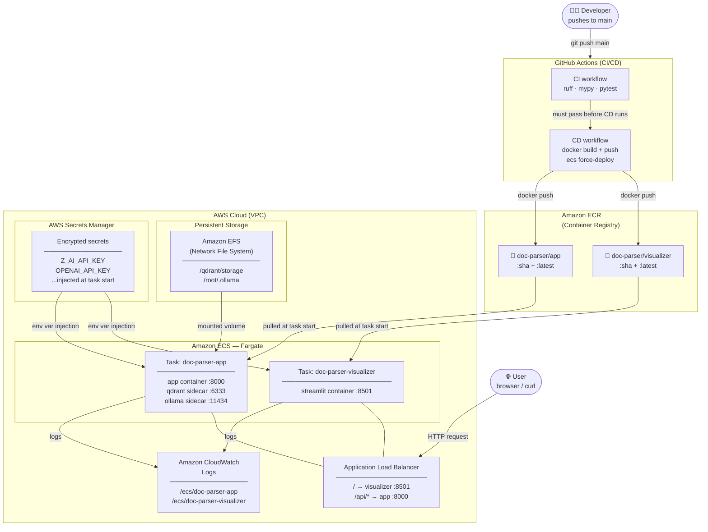
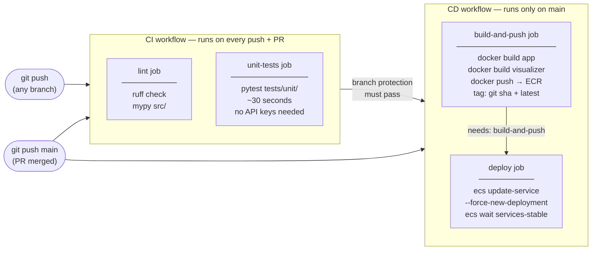
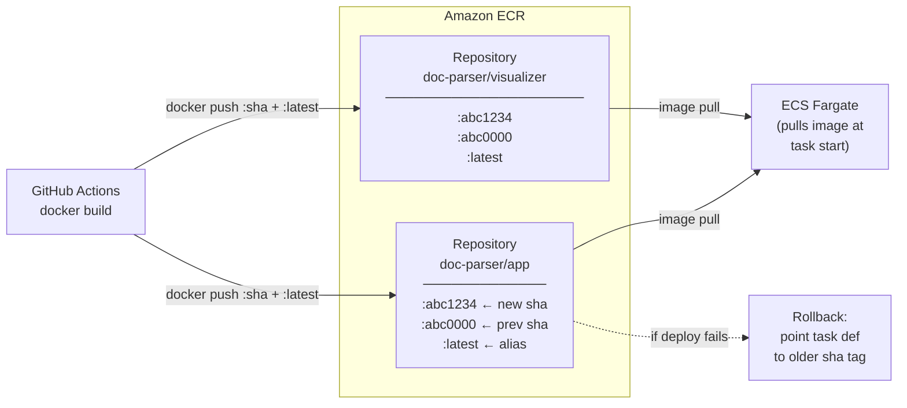
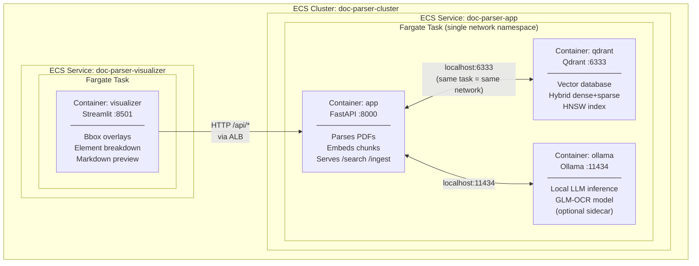
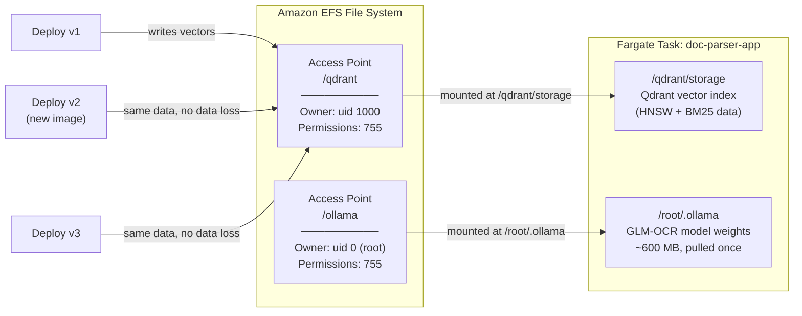
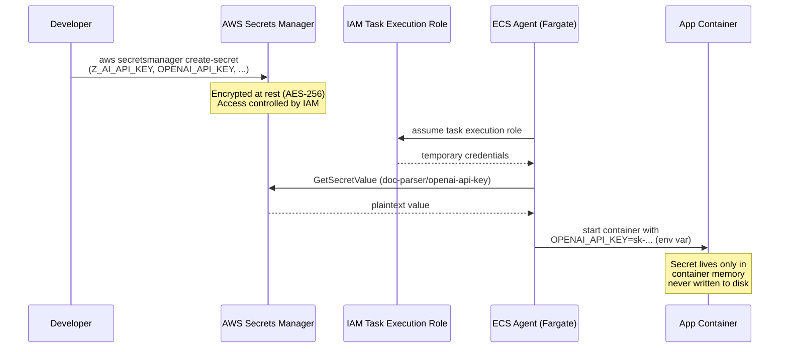
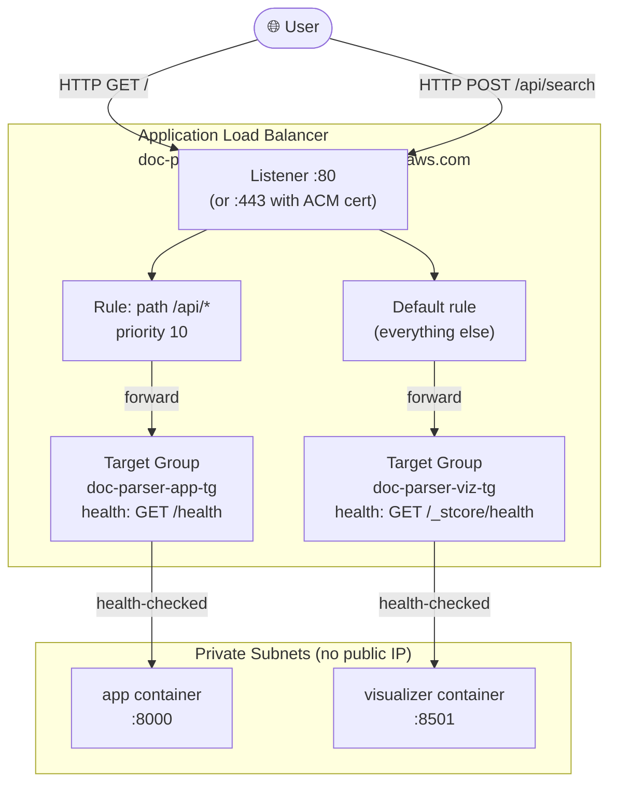
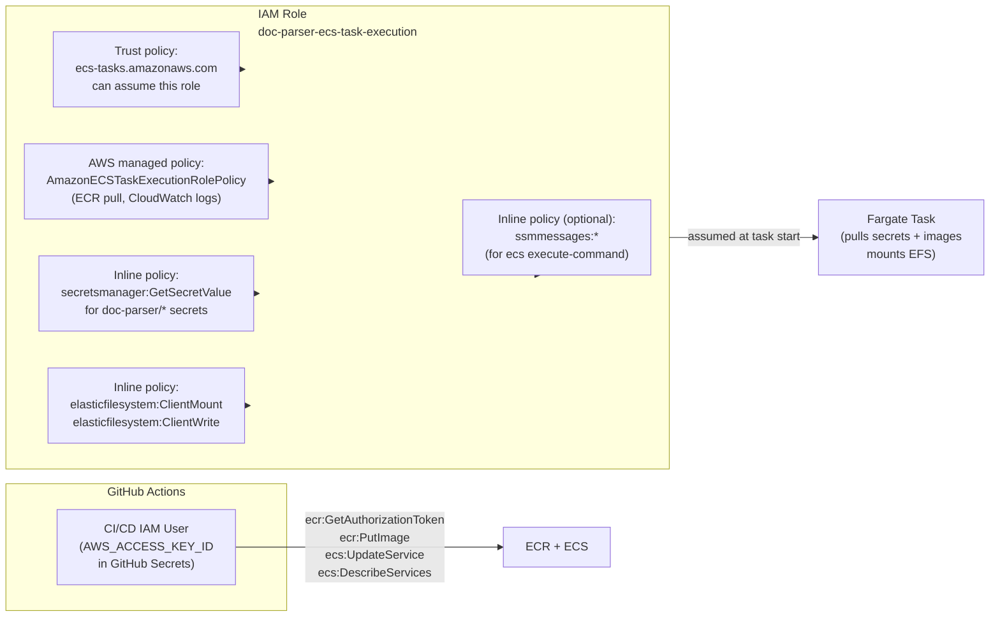
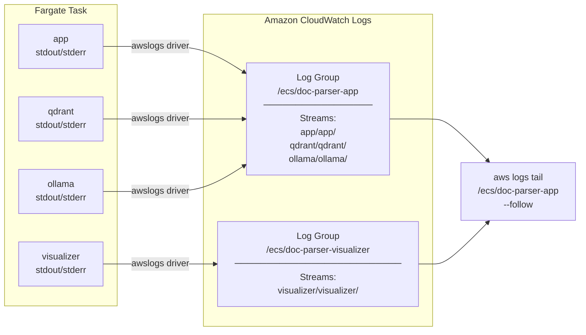
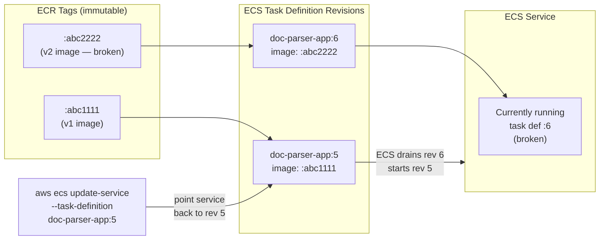

# AWS Deployment Architecture

This document explains how every AWS service fits together when you deploy the MultiModal RAG pipeline. Read top to bottom — each diagram zooms into a different layer.

---

## 1. The Big Picture — End-to-End Flow

From a developer pushing code all the way to a user hitting the live URL.

---

## 2. CI/CD Pipeline — GitHub Actions

What happens inside GitHub Actions on every push and on merge to `main`.

> **Why two separate jobs in CD?**
> `build-and-push` and `deploy` are separated so that if the image push fails, ECS is never asked to deploy a broken image. The `needs:` dependency enforces this order.

---

## 3. Amazon ECR — Container Registry

ECR stores your Docker images. Think of it as Docker Hub but private and inside your AWS account.

> **Why tag with both `:sha` and `:latest`?**
> `:sha` gives you a permanent, immutable tag for rollbacks. `:latest` is what ECS uses by default when it force-deploys — it always picks up the newest image.

---

## 4. Amazon ECS on Fargate — Running the Containers

ECS is the scheduler. Fargate is the serverless compute layer — you never touch a VM.

> **Key concept — sidecar pattern:**
> All containers inside a single Fargate task share the same `localhost`. That's why the `app` container can reach Qdrant at `http://localhost:6333` without any service discovery — they are co-located in the same task.

---

## 5. Amazon EFS — Persistent Storage

EFS is a network file system. It solves two problems: Qdrant data surviving a redeployment, and Ollama model weights not being re-downloaded every time.

> **Why Access Points and not just the raw file system?**
> Access Points enforce a specific root directory and POSIX owner per mount, so the `qdrant` container (uid 1000) and `ollama` container (root) each get their own isolated directory with correct permissions — even though they share one EFS file system.

---

## 6. AWS Secrets Manager — Secret Injection

API keys are never baked into Docker images or passed as plain environment variables. They live in Secrets Manager and are injected at task startup by the ECS agent.

> **Why not just use `.env` on the server?**
> Secrets Manager gives you: audit logs of every access, automatic rotation, fine-grained IAM control over which task role can read which secret, and zero secrets in your git history or Docker layers.

---

## 7. Application Load Balancer — Traffic Routing

One public DNS name, two backend services, path-based routing.

> **Why are ECS tasks in private subnets?**
> The ALB sits in public subnets and is the only entry point. ECS tasks have no public IP — they can't be reached directly from the internet. This is standard AWS security practice (defence in depth).

---

## 8. IAM — Who Is Allowed to Do What

IAM is the permission system. Two principals matter here: the CI/CD bot and the ECS task itself.

> **Principle of least privilege:**
> The CI/CD bot can only push images and trigger deployments — it cannot read secrets or access EFS. The ECS task role can read secrets and mount EFS — but it cannot push new images. Each principal has exactly the permissions it needs and nothing more.

---

## 9. CloudWatch Logs — Observability

Every container streams logs to CloudWatch. No SSH, no log files on disk.

> **The `awslogs` driver** is configured in the task definition under `logConfiguration`. The ECS agent collects stdout/stderr from each container and ships it directly to CloudWatch — no log agent or sidecar needed.

---

## 10. Rollback — What Happens When a Deploy Goes Wrong

Every `register-task-definition` call creates a new numbered revision. ECS never deletes old revisions.

> **Rollback takes ~60 seconds** — ECS drains connections from the old task, starts a new task with the previous revision, waits for its health check to pass, then deregisters the broken task.

---

## Summary — All Services at a Glance

| AWS Service | Role in this project | Student analogy |
|-------------|----------------------|-----------------|
| **ECR** | Stores Docker images | Like Docker Hub, but private in your AWS account |
| **ECS + Fargate** | Runs containers without managing servers | Like Heroku — you give it a Docker image, it runs it |
| **EFS** | Persistent shared file system for containers | Like a USB drive that survives container restarts |
| **ALB** | Routes public traffic to the right container | Like nginx reverse proxy, but managed by AWS |
| **Secrets Manager** | Stores and injects API keys securely | Like a password manager your containers can query |
| **IAM** | Controls who can do what | Like Linux file permissions, but for AWS resources |
| **CloudWatch Logs** | Collects and stores container logs | Like `tail -f` but persistent and searchable |
| **GitHub Actions** | Automates build, test, and deploy | Like a robot that runs your scripts on every git push |
